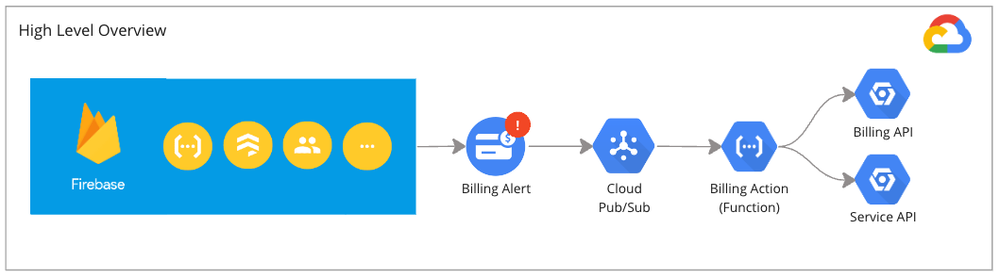

### Post-installation steps

After the installation of this extension, you must:

- Create a Budget against your project (if none exists), and connect it to the Pub/Sub topic created
- Assign the extension's service account the `roles/billing.projectManager` role (for Strategy 1)
- Assign the extension's service account the `roles/serviceusage.service` role (for Strategy 2)

Further detail is provided below.

### Detailed post-installation steps

This extension requires the following post-installation steps:

1. Create a budget if none exists:
   - **Firebase**: Go to Settings > Usage & Billing. Set a budget and note its name (Recommended)
   - **GCP**: Navigate to Billing > Budgets. Create a new budget, set it, and note the budget name.
2. Check that your budget is configured correctly - ensure that there is a threshold of 100%.
3. Connect your budget to the Pub/Sub topic created by the extension (defined under the `TOPIC_NAME` parameter during installation). This can be done by editing your budget.
4. Assign the extension's service account (`ext-functions-auto-stop-billing@{PROJECT_ID}.iam.gserviceaccount.com`) the appropriate IAM roles:

- Strategy 1: Project Billing Manager (`roles/billing.projectManager`)
- Strategy 2: Service Usage Admin (`roles/serviceusage.serviceUsageAdmin`)

### Operating the extension

### How it all works


Once all the post-installation steps are completed, the Pub/Sub topic we setup will listen to the budget for an alert. When an alert is raised that meets (or exceeds) the defined threshold a Firebase function will execute the strategy you select.

#### What happens?

There are three key components to this extension:

- Budget - will monitor your costs and raise an alert at pre-defined thresholds.
- Pub/Sub topic - will receive any alerts raised and provide them to subscribers.
- Firebase function - will receive alerts, assess, and take appropriate action (dismiss or stop services)

The budget will generate messages and send them to the topic, these messages are structured as:

```json
{
  "budgetDisplayName": "Your Budget Name",
  "alertThresholdExceeded": 0.5,
  "costAmount": 500.0,
  "projectId": "your-project-id",
  "billingAccountId": "012345-6789AB-CDEF01"
}
```

The field `alertThresholdExceeded` is monitored by the extension, and will determine whether or not to take action. Where the value of this field meets or exceeds the parameter `BUDGET_STOP_THRESHOLD_PERCENT` then the strategy is executed.

#### Testing permissions

The easiest way to test this extension is to publish a test message into the topic `TOPIC_NAME`. You can use the test message with the content:

```
{
  "extensionTest" : true
}
```

This will validate that the extension has the necessary permissions to execute the service stop. You can monitor Logs Explorer to see the results.

### Additional Notes

This extension is aimed at supporting Firebase users to prevent cost-overrun. There are some additional points to keep in mind when using this extension:

- Review and confirm Service Account permissions includes the roles assigned to the extension's service account are sufficient to perform its tasks.
- Even with this extension, you should monitor your Google Cloud costs and usage through the Google Cloud Console.
- Remember, disabling essential services can impact your application's functionality. Plan and test carefully. Please consider capturing your configuration through your code repository (versus click ops).

### Getting Help

For issues or questions about this extension, check the [GitHub repository](https://github.com/deep-rock-development/auto-stop-firebase-ext) or reach out through Firebase support.
