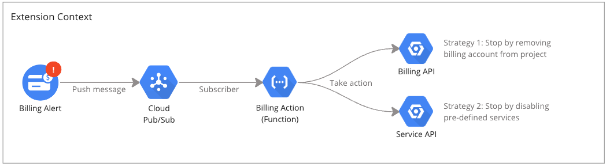

# Auto Stop Services Firebase Extension

[](https://www.buymeacoffee.com/keston)

## What is this?

This extension is intended to support development, or early stage production environments from accruing significant costs by stopping services. This is a challenge as cloud platforms are usage based, and many methods provided by cloud providers are intended to support service uptime; and will not make any effort to mitigate unintended service overuse. Billing alerts are out of the box only intended to alert administrators that a budget threshold has been reached, but not take any action.

## How does it work?


This Firebase extension monitors the associated budget and implements one of two strategies when a specified budget threshold is reached:

1. **Remove billing account from the project** (Strategy 1)
2. **Disable predefined services** (Strategy 2)

### Strategy 1: Removing the Billing Account from Project

When a billing account is removed from a project:

- **Service Suspension**: All paid services within the project are immediately suspended. This includes VM instances, databases, and other cloud services that incur costs.
- **Access to Resources**: You can still access and view resources in the Google Cloud Console, but you cannot create new resources or use services that require billing.
- **Data Persistence**: Data stored in services like Cloud Storage, Firestore, and databases is preserved but may become inaccessible until billing is re-enabled.
- **Project Functionality**: Essential Google Cloud services, including IAM and Google Cloud Console access, remain available for managing project settings and restoring billing.
- **Billing Charges**: Any pending charges accrued before the billing account was removed will still be billed. No new charges will be generated until billing is re-established.

This strategy prevents additional costs from accruing but has an immediate impact on service availability.

### Strategy 2: Disable Predefined Services

When specific services are disabled (e.g., `compute.googleapis.com`, `cloudfunctions.googleapis.com`):

- **Service-Specific Impact**: The disabled service immediately stops all operations. For instance, disabling `compute.googleapis.com` halts all running VM instances, and disabling `cloudfunctions.googleapis.com` stops all Cloud Functions executions.
- **No New Resources**: Creating new resources for the disabled services is not possible. Attempts to do so will result in errors.
- **Existing Resources**: Existing resources for the disabled service remain in place but become inactive. For VM instances, they are stopped; for Cloud Functions, they are not invokable.
- **Data and Configuration Preservation**: Configurations, data, and settings related to the disabled service are preserved, allowing service resumption by re-enabling.
- **Billing**: Disabling a service stops new billing for that service, though charges may still accrue for storage and other passive resources.

This strategy offers granular control over cost management by allowing selective service suspension while preserving critical operational functionality.

## Installation Configuration


During the extension installation, you will be asked to configure it with the following parameters:

- `TOPIC_NAME` defines the name of the pub/sub topic. A billing alert is published here, which will trigger the auto-stop (if the threshold is reached).
- `BUDGET_STOP_THRESHOLD_PERCENT` defines the percentage (0.0-1.0) of the budget that will trigger the stop strategy, default is 1.0 (100%)
- `DISABLE_BILLING` enables strategy 1 - to remove the billing account (requires `project billing manager` role), defaults to false
- `DISABLE_API_LIST` enables strategy 2 - to disable services (requires `service usage admin` role), defaults to none (empty)
- `LOCATION` defines the deployment location for the cloud function, defaults to use-central1

## Manual Steps After Installation

After installing the extension, you must:

1. **Set Up a Budget**

   - **Firebase**: Go to Settings > Usage & Billing. Set a budget and note its name.
   - **GCP**: Navigate to Billing > Budgets. Create a new budget, set it, and note the budget name.

2. **Connect the Budget to a Predefined Topic**

   - Link the budget to the topic specified when installed the extension: `{TOPIC_NAME}`.

3. **Update the Service Account Permissions**
   - Grant the following IAM roles to `{EXTENSION_NAME}@{PROJECT_ID}.iam.gserviceaccount.com`:
     - **Strategy 1:** Grant Project Billing Manager (`roles/billing.projectManager`) to manage project billing settings.
     - **Strategy 2:** Service Usage Admin (`roles/serviceusage.serviceUsageAdmin`) for enabling/disabling service APIs.

**Note**: Disabling the Cloud Functions service API (`cloudfunctions.googleapis.com`) will remove the extension's functions, effectively uninstalling the extension. This will always be disabled last.

## Example Pub/Sub Message

When a budget alert fires, the message content will look like the below:

```json
{
  "budgetDisplayName": "Your Budget Name",
  "alertThresholdExceeded": 0.5,
  "costAmount": 500.0,
  "costIntervalStart": "2021-01-01T00:00:00Z",
  "budgetAmount": 1000.0,
  "budgetAmountType": "SPECIFIED_AMOUNT",
  "currencyCode": "USD",
  "schemaVersion": "1.0",
  "notificationType": "ACTUAL",
  "projectId": "your-project-id",
  "billingAccountId": "012345-6789AB-CDEF01"
}
```

The key element of this message is the `alertThresholdExceeded`, all other information is effectively discarded.

## Testing this Extension

Once you have followed the steps, you can submit a message through the pub/sub topic. Any results will be published as logs, which you can monitor.

This example message will not execute any strategy.

```json
{
  "extensionTest": true
}
```
