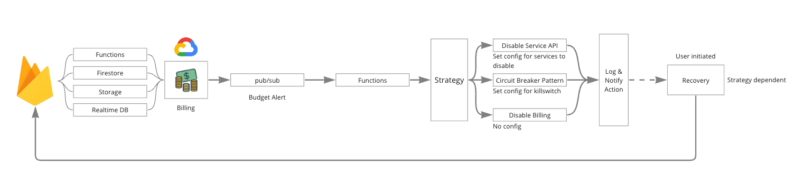

# auto-stop-firebase-ext

Firebase extension to stop services when a quota has been reached.

# High Level View



## Manual Steps

- Create a budget with pre-defined thresholds.
  - Firebase: Navigate to Settings > Usage & Billing, and set a budget. Note the name of the budget.
  - GCP: Navigate to Billing > Budget, create a new budget and set it. Note the name of the budget.
- Connect budget to pre-defined topic `{TOPIC_NAME}`
- INSTALL THE EXTENSION
- Update the service account `{EXTENSION_NAME}@{PROJECT_ID}.iam.gserviceaccount.com` to include the following roles:
  - Service Usage Admin (`roles/serviceusage.serviceUsageAdmin`); this will allow the function to enable/disable service APIs

Notes:

- When the cloudfunctions service API is disabled, the extension's functions will be removed. This will effectively uninstall the extension.

## Example pubsub message

```
    {
    "budgetDisplayName": "Your Budget Name",
    "alertThresholdExceeded": 0.5,
    "costAmount": 500.00,
    "costIntervalStart": "2021-01-01T00:00:00Z",
    "budgetAmount": 1000.00,
    "budgetAmountType": "SPECIFIED_AMOUNT",
    "currencyCode": "USD",
    "schemaVersion": "1.0",
    "notificationType": "ACTUAL",
    "projectId": "your-project-id",
    "billingAccountId": "012345-6789AB-CDEF01"
    }
```
